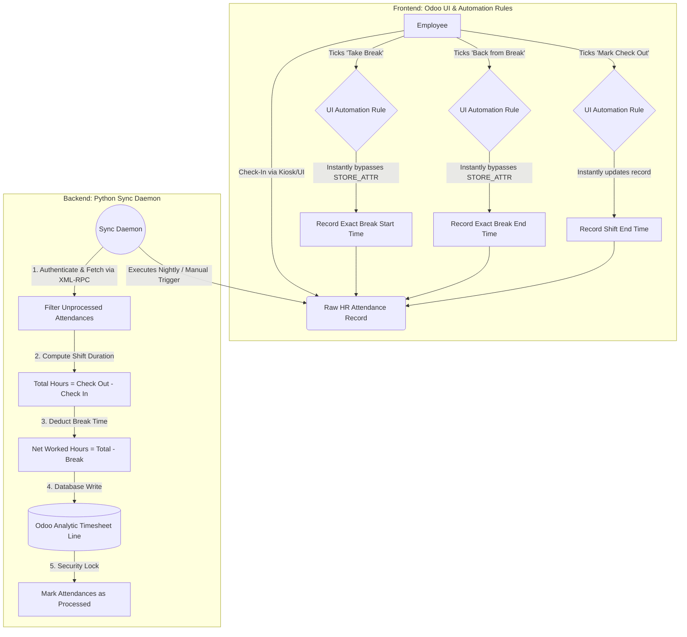

# Odoo Timesheet & Attendance Automation Ecosystem

> [!NOTE]
> This project provides an enterprise-grade, highly secure Attendance and Timesheet synchronization architecture for the Odoo ERP environment. It eliminates the need for manual timesheet entries by capturing real-time employee attendance events and utilizing a background synchronization daemon to calculate actual worked hours.

## 👤 Author
**Vamshi Batthula**  
📧 batthulavamshi740@gmail.com

---

## 🏗️ System Architecture & Workflow

The architecture is divided into two primary subsystems: the **Frontend UI Automation Engine** and the **Backend Timesheet Synchronization Daemon**. 



### 1. Frontend UI Automation Engine
To prevent manual data tampering and assure high data integrity, the system utilizes Odoo's `On UI Change` automation triggers. 
- **Real-Time Capture**: Custom Boolean Checkboxes (`x_take_break`, `x_back_from_break`, `x_do_check_out`) are injected into the Odoo UI.
- **Secure Timestamping**: When an employee interacts with these checkboxes, Odoo's internal `safe_eval` environment directly invokes a `record.update()` bypass method, assigning the exact `datetime.now()` server time to the underlying models instantly.

### 2. Backend Timesheet Synchronization Daemon
A fault-tolerant Python daemon (`attendance_sync_daemon.py`) that operates externally via Odoo's XML-RPC API.
- **Idempotent Processing**: Scans for attendances where `x_is_timesheet_processed = False`.
- **Time Calculations**: Extrapolates total shift seconds, subtracts the recorded break seconds, and converts to precision float hours.
- **Record Generation & Locking**: Automatically provisions `account.analytic.line` timesheet entries tied to the employee's default project, and permanently locks the source attendance records to prevent duplicate billing.

---

## 🛠️ Key Technologies & Stack
- **Odoo XML-RPC API**: Robust external communication protocol.
- **Python 3**: Core backend execution environment.
- **Background Daemon Processing**: Continuous loop execution using the standard `time` library.
- **Flask REST API**: A lightweight routing API (`app.py`) built to scale into external dashboard integrations.
- **Environment Security**: Usage of `python-dotenv` for encrypted `.env` injection of Odoo credentials.

## 🚀 Deployment & Usage

### 1. Environment Setup
Create a `.env` file in the root directory (ignored by git):
```env
ODOO_URL=http://your-odoo-instance:8069
ODOO_DB=your_database
ODOO_USERNAME=admin
ODOO_PASSWORD=your_secure_password
```

### 2. Install Dependencies
```bash
pip install -r requirements.txt
```

### 3. Run the Processing Engine
**Continuous Background Daemon** (Runs every 24 hours):
```bash
python attendance_sync_daemon.py
```
**Manual Override / Immediate Sync**:
```bash
python attendance_sync_daemon.py --run-now
```

### 4. Run the API Server (Optional)
```bash
python app.py
```
